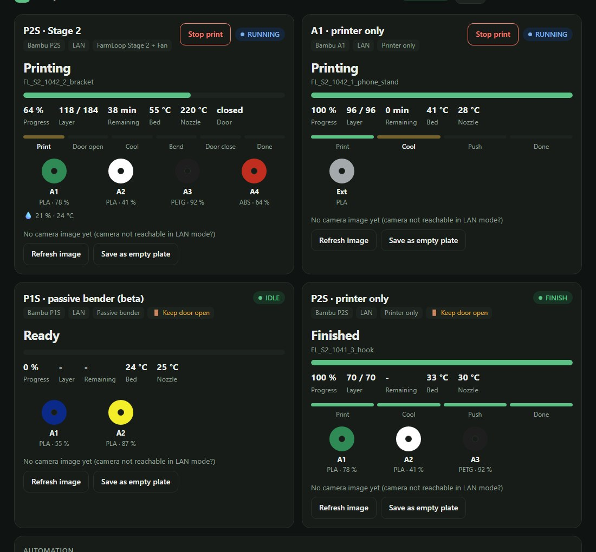

<div align="center">

<picture>
  <source media="(prefers-color-scheme: dark)" srcset="images/logo-wide-light.png">
  
</picture>

### Run your Bambu Lab print farm unattended.
One dashboard, any number of printers, no subscription.

[](https://github.com/DaniAeschbach/loopimir/releases)
[](LICENSE)
[](docs/PRINTERS.md)

[Deutsch](README.de.md)



</div>

## What it does

Upload models (or an order). Loopimir slices each piece for the printer it runs on, prints it, cools it right for the material, ejects it and starts the next one — on all your printers, from one queue.

## Install

```bash
curl -fsSL https://raw.githubusercontent.com/DaniAeschbach/loopimir/main/scripts/install.sh | bash
```

Open `http://<your-machine>:8090`, add your printers, drop a model, switch on **Start jobs automatically**. That's it.
Needs an x86‑64 Linux machine (Debian / Ubuntu / Mint, ~4 GB RAM) — a Raspberry Pi does not work.

## Printers

| | Status | Extra hardware (optional) |
|---|---|---|
| **Bambu Lab P2S** | ✅ proven | Printer only · Passive bender *(experimental)* · FarmLoop Stage 2 |
| **Bambu Lab A1** | ✅ tested | Printer only · FarmLoop Stage 2 |
| **Bambu Lab P1S** | 🧪 **beta** — no real print yet | Printer only · Passive bender · FarmLoop Stage 2 |

> Pre-release: start with short test prints and stay nearby until you trust your setup. Details in [docs/PRINTERS.md](docs/PRINTERS.md).

## Docs

[**Guide**](docs/GUIDE.md) · [Printers & hardware](docs/PRINTERS.md) · [Board](docs/BOARD.md) · [Cooling](docs/COOLING.md) · [Bambu Studio mode](docs/STUDIO-MODE.md) · [Troubleshooting](docs/TROUBLESHOOTING.md)

Found a bug or tested a printer? [Open an issue](https://github.com/DaniAeschbach/loopimir/issues/new/choose) — test reports are very welcome.

## License

Free to use and share, closed source — see [LICENSE](LICENSE) and [NOTICE](NOTICE.md). Not affiliated with Bambu Lab. Use at your own risk.
