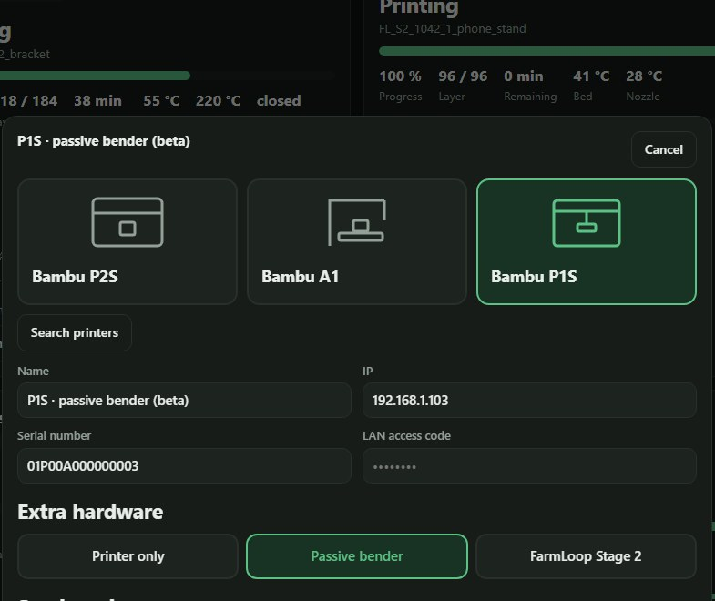

# Guide / Anleitung

[English](#english) · [Deutsch](#deutsch)

<a name="english"></a>
## English

### 1. Install
On an always-on x86‑64 Linux machine (Debian / Ubuntu / Mint, ~4 GB RAM; a Raspberry Pi does not work):

```bash
curl -fsSL https://raw.githubusercontent.com/DaniAeschbach/loopimir/main/scripts/install.sh | bash
```

Open `http://<machine>:8090` and set a page password in *Settings*. Your data lives in `~/.local/share/loopimir`. Logs: `journalctl -u loopimir -f`.

### 2. Prepare each printer
On the printer: **Settings → Network** → switch on **LAN Only mode** and **Developer mode**, and note the **IP address**, **serial number** and **access code**. Put an **SD card** in the printer and give it a fixed IP in your router.

*(Want to keep the printer in the Bambu cloud? See [Bambu Studio mode](STUDIO-MODE.md).)*

### 3. Add your printers
**Printers** (top right) → **Add printer**: pick the model, click your printer in the search results (or type IP and serial), enter the access code, choose your **extra hardware** ([which one?](PRINTERS.md)), **Connect**. Repeat for every printer.



### 4. First test print
1. Leave **Start jobs automatically** off.
2. Drag a small **STL** or **STEP** (a 20 mm cube) into *New order*, pick loaded filament, *Upload*.
3. After it is sliced and checked (a minute or two), press **Start now** — and stay next to the printer.
4. When the part is ejected and the plate is empty, press **Plate is clear**.

Works? Switch on **Start jobs automatically**. Optionally switch off **Confirm plate after every print**. After a clean push press **Save as empty plate** on the printer card (the camera compares the plate with this picture).

### Orders
You can also upload a `.txt` order with the models:

```
Order Number: 1042
ITEM SPECIFICATIONS

1. bracket.stl
   Material: PLA Basic
   Color: Green
   Layer Height: 0.2mm
   Infill: 15%
   Quantity: 3

UPLOADED FILES
```
Every piece becomes its own job. **STL or STEP** (STEP is converted to STL automatically; if a very large STEP file hits the time or memory limit, export it as STL yourself). Job waits? The reason is shown under the job; **Plate is clear** is the usual one.

### Updates, backup, uninstall
- **Updates** install themselves (*Settings → Updates*), or run the install command again (safe while Loopimir is running). If GitHub serves an old cached script, wait 5 minutes. Installed before v0.2.0? Re-run the installer once.
- **Backup:** copy `~/.local/share/loopimir`.
- **Uninstall:**
  ```bash
  curl -fsSL https://raw.githubusercontent.com/DaniAeschbach/loopimir/main/scripts/uninstall.sh | bash
  ```
  Add `-s -- --purge` after `bash` to delete your data as well.

Problems? → [Troubleshooting](TROUBLESHOOTING.md)

---

<a name="deutsch"></a>
## Deutsch

### 1. Installieren
Auf einem dauerhaft laufenden x86‑64‑Linux‑Rechner (Debian / Ubuntu / Mint, ~4 GB RAM; ein Raspberry Pi geht nicht):

```bash
curl -fsSL https://raw.githubusercontent.com/DaniAeschbach/loopimir/main/scripts/install.sh | bash
```

`http://<maschine>:8090` öffnen und in den *Einstellungen* ein Seiten‑Passwort setzen. Daten liegen in `~/.local/share/loopimir`. Log: `journalctl -u loopimir -f`.

### 2. Jeden Drucker vorbereiten
Am Drucker: **Einstellungen → Netzwerk** → **Nur‑LAN‑Modus** und **Entwicklermodus** einschalten, **IP‑Adresse**, **Seriennummer** und **Zugangscode** notieren. **SD‑Karte** einstecken und im Router eine feste IP vergeben.

*(Drucker in der Bambu‑Cloud lassen? Siehe [Bambu‑Studio‑Weg](STUDIO-MODE.md#deutsch).)*

### 3. Drucker hinzufügen
**Drucker** (oben rechts) → **Drucker hinzufügen**: Modell wählen, den Drucker in den Suchergebnissen anklicken (oder IP und Seriennummer eintippen), Zugangscode eintragen, **Zusatz‑Hardware** wählen ([welche?](PRINTERS.md#deutsch)), **Verbinden**. Für jeden Drucker wiederholen.

### 4. Erster Testdruck
1. **Automatisch starten** aus lassen.
2. Ein kleines **STL** oder **STEP** (20‑mm‑Würfel) in *Neue Bestellung* ziehen, geladenes Filament wählen, *Hochladen*.
3. Nach dem Slicen und Prüfen (ein bis zwei Minuten) **Jetzt starten** — und beim Drucker bleiben.
4. Teil ausgeworfen, Platte leer? **Platte ist frei**.

Klappt es? **Automatisch starten** einschalten, optional **Platte nach jedem Druck bestätigen** ausschalten. Nach einem sauberen Schieben auf der Druckerkarte **Als leere Platte speichern** (die Kamera vergleicht die Platte mit diesem Bild).

### Bestellungen
Zusätzlich kannst du eine `.txt`‑Bestellung mit den Modellen hochladen:

```
Order Number: 1042
ITEM SPECIFICATIONS

1. bracket.stl
   Material: PLA Basic
   Color: Green
   Layer Height: 0.2mm
   Infill: 15%
   Quantity: 3

UPLOADED FILES
```
Das Format genau wie im Beispiel übernehmen. Jedes Stück wird ein eigener Auftrag. **STL oder STEP** (STEP wird automatisch in STL umgewandelt; stößt eine sehr große STEP‑Datei an die Zeit‑ oder Speichergrenze, sie selbst als STL exportieren). Wartet ein Auftrag? Der Grund steht darunter; meist ist es **Platte ist frei**.

### Updates, Backup, Entfernen
- **Updates** installieren sich selbst (*Einstellungen → Updates*), oder den Installationsbefehl noch einmal ausführen (geht auch, während Loopimir läuft). Liefert GitHub ein altes, zwischengespeichertes Skript, 5 Minuten warten. Vor v0.2.0 installiert? Installer einmal erneut ausführen.
- **Backup:** `~/.local/share/loopimir` kopieren.
- **Entfernen:**
  ```bash
  curl -fsSL https://raw.githubusercontent.com/DaniAeschbach/loopimir/main/scripts/uninstall.sh | bash
  ```
  Mit `-s -- --purge` nach `bash` werden auch die Daten gelöscht.

Probleme? → [Fehlersuche](TROUBLESHOOTING.md#deutsch)
